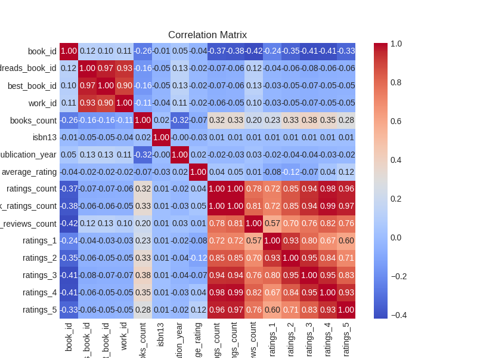
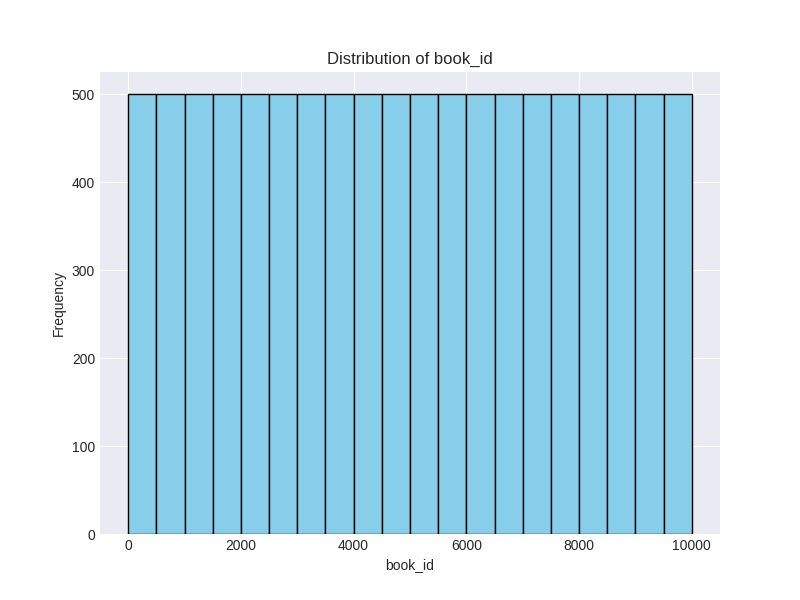
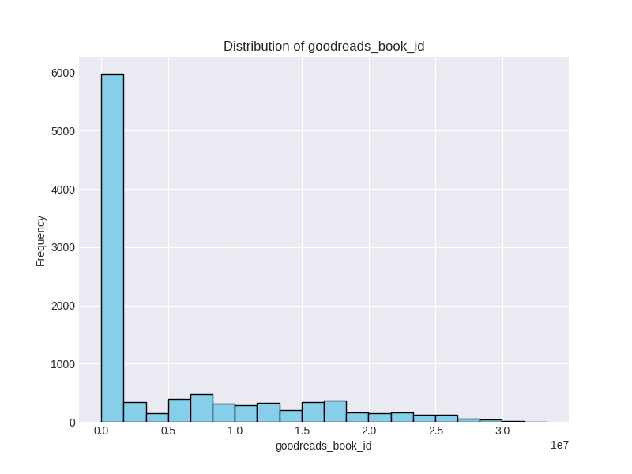
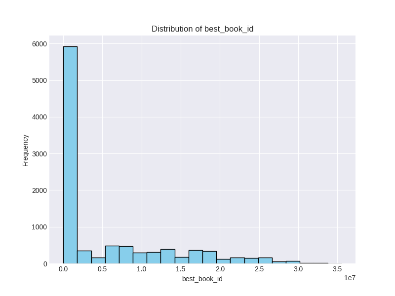
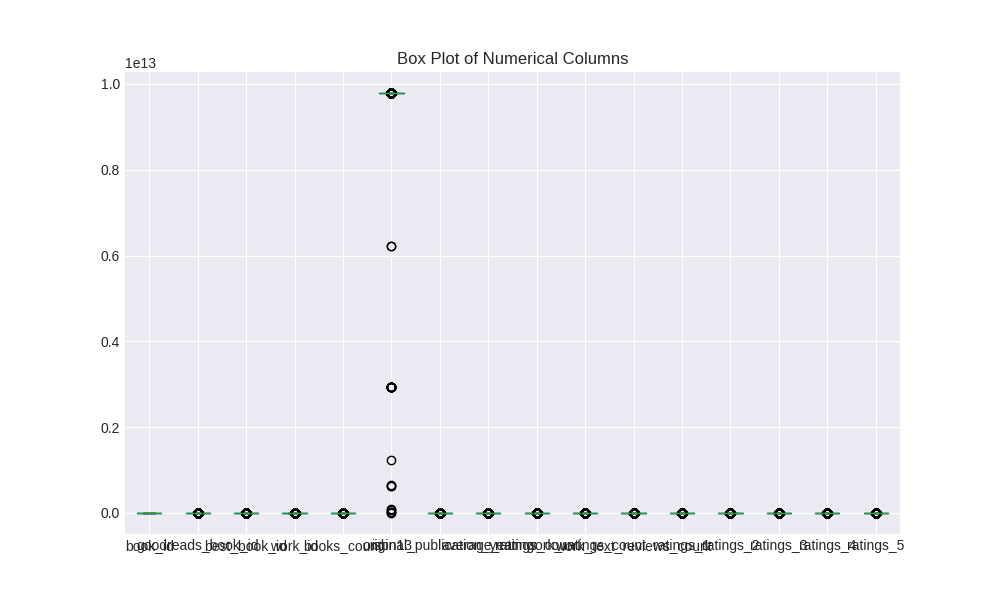

# Automated Analysis Report

Generated on 2024-12-16 13:40:59

## Analysis Summary

### Story of the Data Analysis on Goodreads Dataset

#### The Data Received
The journey began with a dataset encapsulating a treasure trove of information about books on Goodreads, aptly named **`goodreads.csv`**. This dataset contained **10,000 rows** and **23 columns**, each holding crucial details about various books. The columns included unique identifiers for each book, author names, publication years, language codes, and ratings, among others. 

Before diving into analysis, a brief examination revealed some intriguing aspects:
- Key identifiers like `book_id`, `goodreads_book_id`, and `title` were complete with no missing values.
- However, a notable number of missing entries were identified in critical fields, particularly `isbn`, `isbn13`, `original_publication_year`, `original_title`, and `language_code`.

#### The Analysis Carried Out
With the data loaded, the analytical phase commenced through **Exploratory Data Analysis (EDA)**. The primary steps included:

1. **Data Loading**: The dataset was securely imported from the CSV file.
   
2. **Categorical and Numerical Separation**: Columns were classified into numerical and categorical types, streamlining the analysis process.

3. **Generating Summary Statistics**: Using functions like `df.describe()`, summary statistics such as mean, median, and standard deviation were generated to gain a grasp of data distributions.

4. **Evaluating Missing Values**: The extent of missing data was assessed using `df.isnull().sum()`, highlighting significant gaps in fields like `isbn` and `language_code`.

5. **Correlation Exploration**: A correlation matrix was created to unveil the relationships between numerical variables, visualized with a heatmap via `sns.heatmap()`, enabling quick interpretation.

6. **Outlier Detection**: Boxplots were crafted to identify outliers in numerical columns, a vital step for ensuring data quality and integrity.

#### The Insights Discovered
The analysis revealed several key insights:

1. **High Average Ratings**: On average, books had a rating of around **4.00**, with a standard deviation suggesting a strong satisfaction among readers.

2. **Publication Year Range**: The original publication year ranged broadly from a past estimate of **-1750** to modern releases in **2017**, indicating a historical breadth in the catalog.

3. **Skewed Ratings Distribution**: Most ratings gravitated towards higher star categories, revealing a skewness in reader preferences toward positive reviews.

4. **Correlations**: 
   - Significant positive correlations were found among different rating categories (ratings from 1 to 5 stars).
   - A negative correlation was noted between `books_count` and `ratings_count`, suggesting that books with many editions might receive lesser overall ratings.

5. **Outliers Presence**: The presence of extreme values in ratings and reviews indicated that certain books either garnered exceptional popularity or faced disproportionate criticism.

#### The Implications of Findings
Given these insights, the implications for stakeholders were substantial:

1. **Recommendation Systems**: By identifying books with high ratings and review counts, a more tailored recommendation system could be developed to enhance user experiences on the Goodreads platform.

2. **Data Imputation Strategies**: Handling missing data in critical fields like ISBNs could be vital for accurate bibliographic queries and tracking book trends.

3. **Outlier Investigations**: Further investigation into outliers might provide opportunities to highlight bestsellers or investigate inexplicably poor-rated books, offering deeper marketing or editorial insights.

4. **Understanding Trends**: Analysis of ratings and publication years could illuminate trends in reader preferences over time, which may influence acquisition and marketing strategies for publishing houses.

5. **Author and Genre Analysis**: Delving deeper into authors and genres associated with high ratings could uncover patterns that can guide publishers on emerging trends.

Through this thorough analysis, the data not only paints a vivid picture of reader behaviors and book characteristics but also serves as a guiding light for strategic decisions that could enhance user engagement on platforms like Goodreads. Thus, what began as mere numbers on a spreadsheet evolved into a narrative filled with potential strategies for the publishing ecosystem.

## Visualizations

