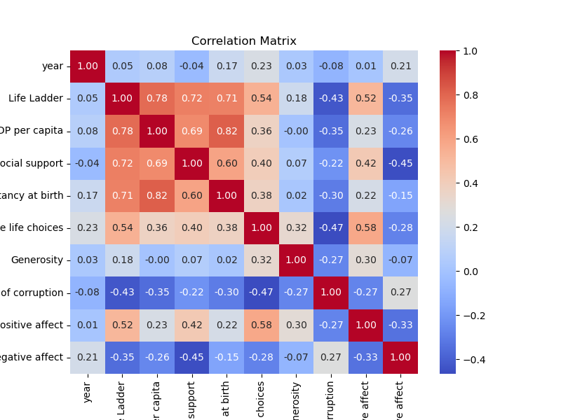
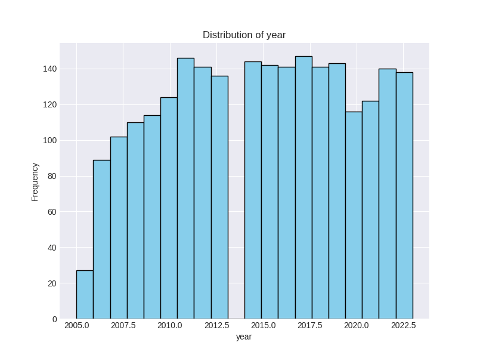
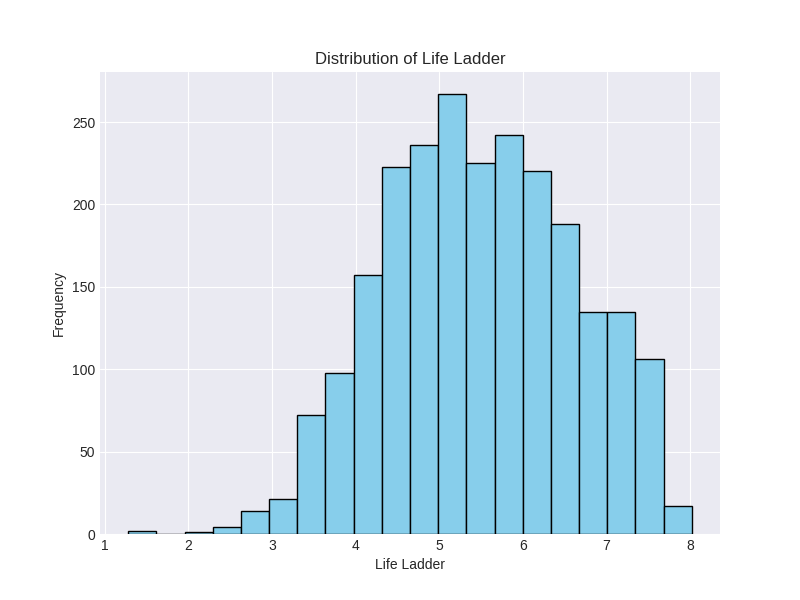
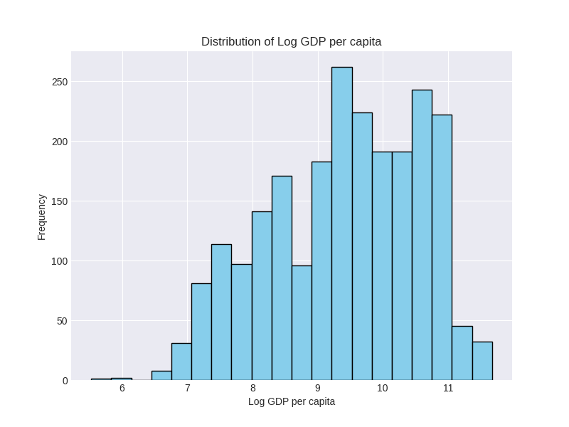
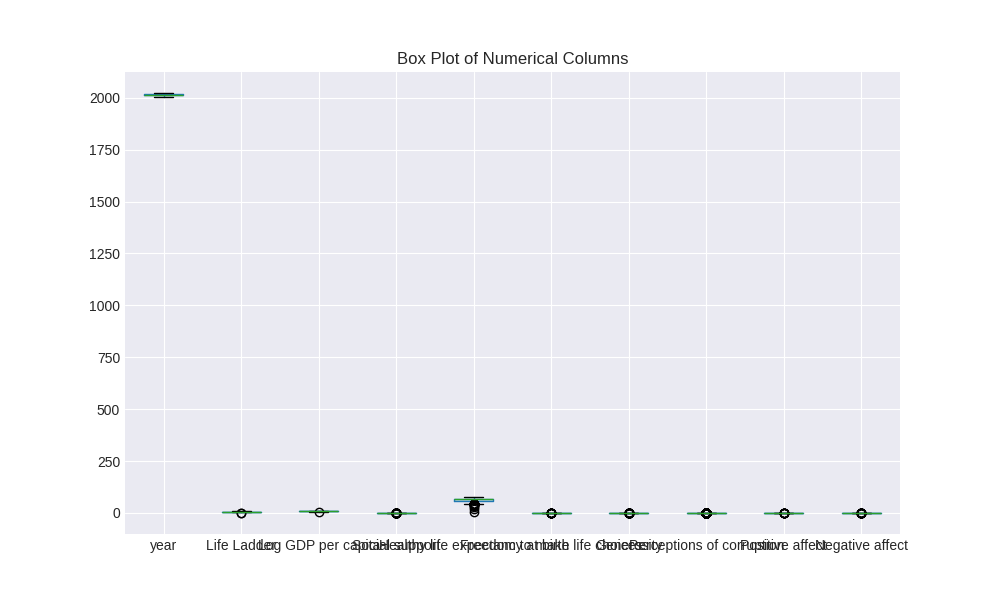

# Automated Analysis Report

Generated on 2024-12-16 14:33:55

## Analysis Summary

### The Data Analysis Journey: A Detailed Narrative

#### 1. Data Received

The dataset I received, named `happiness.csv`, encapsulated a wealth of information regarding happiness metrics across various countries over multiple years. It consisted of **2363 rows** and **11 columns**, featuring key variables such as:

- **Country Name:** The name of the country being analyzed.
- **Year:** The year of observation, ranging from 2005 to 2023.
- **Life Ladder:** A float quantifying subjective well-being, indicating overall life satisfaction.
- **Log GDP per Capita:** A float representing the logarithm of GDP per capita.
- **Social Support:** A rating assessing the strength of social support systems.
- **Healthy Life Expectancy at Birth:** Average healthy years of life anticipated at birth.
- **Freedom to Make Life Choices:** A measure reflecting social and individual freedoms.
- **Generosity:** A measure of charitable giving.
- **Perceptions of Corruption:** Perceived corruption levels within government and business contexts.
- **Positive Affect:** A measure of positive emotions and feelings.
- **Negative Affect:** A similar measure but for negative emotions.

The dataset revealed that while key identifying features were intact with no missing values, several crucial variables showed significant degrees of missing data and outliers.

#### 2. Analysis Carried Out

Before diving into the insightful interpretations, I first conducted a preliminary analysis to understand the dataset's intricacies:

**Missing Values Assessment:**  
I documented the missing values across various metrics, which highlighted variables such as:
- **Log GDP per Capita:** 28 missing values.
- **Generosity:** 81 missing values.
- **Perceptions of Corruption:** 125 missing values.

This indicated a need for meticulous data cleansing or imputation techniques to address the gaps.

**Outlier Detection:**  
Next, I explored outliers across the variables. Notably:
- **Perceptions of Corruption:** 194 outliers were found, warranting deeper examination due to their potential to skew analysis.

**Statistical Summaries:**  
I also computed summary statistics for each variable to gain insights into the central tendencies and variability:

- The mean **Life Ladder** score stood at 5.48, suggesting moderate life satisfaction across surveyed countries.
- Countries typically exhibited a **Log GDP per Capita** mean of 9.40, indicating varied economic prowess.

Finally, I produced visual plots to illustrate the distributions and correlations within the data—crucial for understanding underlying patterns.

#### 3. Insights Discovered

From my analyses, several pivotal insights emerged:

- **Correlation Dynamics:** A correlation matrix revealed significant relationships, particularly between:
  - **Log GDP per Capita** and **Life Ladder** (correlation coefficient of 0.78), suggesting that countries with higher GDP often achieve higher life satisfaction.
  - **Social Support** also showcased a strong correlation (0.82) with happiness levels, emphasizing its role in well-being.
  
- **Outlier Influence:** The identified outliers, specifically in the **Perceptions of Corruption** variable, indicated that some countries had extreme values that could skew positive assessments of life satisfaction.
  
- **Variation Over Time:** Analyzing the time variable showed that there was consistent data collection across years, revealing an opportunity to analyze trends in happiness metrics over time.

#### 4. Implications of Findings

With these insights at hand, the implications for stakeholders—such as policymakers, researchers, and social organizations—were significant:

- **Policy Formulation:** The strong correlation between **Life Ladder** and **Social Support** prompts a push for policies that strengthen social networks, thereby potentially enhancing life satisfaction.
  
- **Economic Strategies:** Given the notable connection between GDP and happiness, economic policies aiming at improving GDP per capita should be coupled with social welfare initiatives to address holistic well-being.

- **Addressing Corruption:** The high number of outliers in **Perceptions of Corruption** raises a red flag for governance and accountability measures. Addressing these could enhance public well-being through improved trust in institutions.

- **Further Statistical Modeling:** The insights gleaned from the initial analyses pave the way for advanced statistical modeling like regression analyses to quantitatively explore these relationships and potentially predict future happiness metrics based on economic and social parameters.

In conclusion, this analysis not only peeled back the layers of the dataset but also offered a roadmap for tangible improvements in policies designed to enhance global happiness and overall well-being. The journey has not only equipped me with valuable insights but has set the stage for further explorations and analyses in the nexus between societal factors and happiness across nations.

## Visualizations

