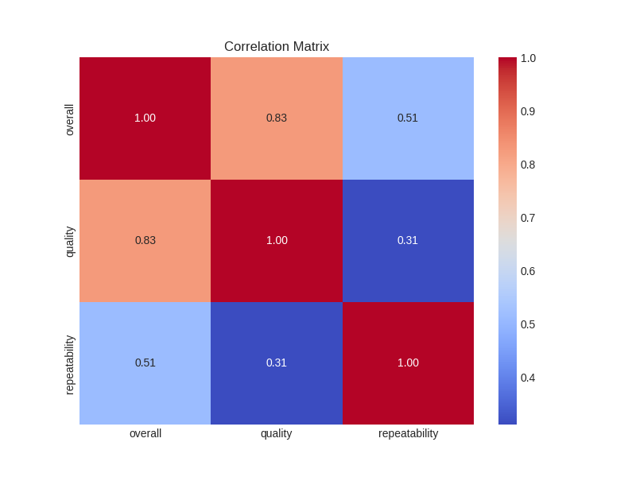
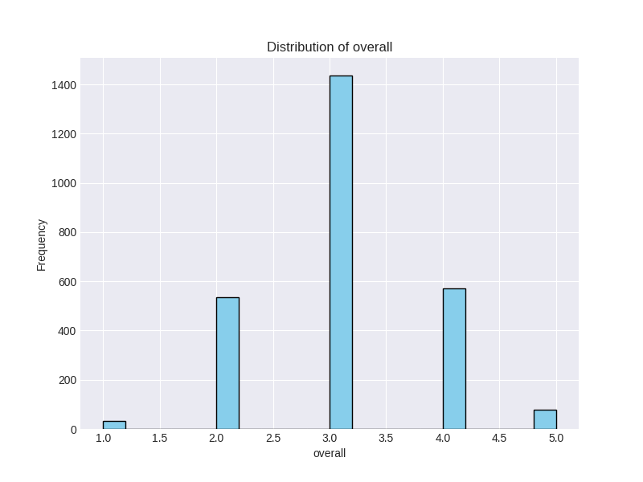
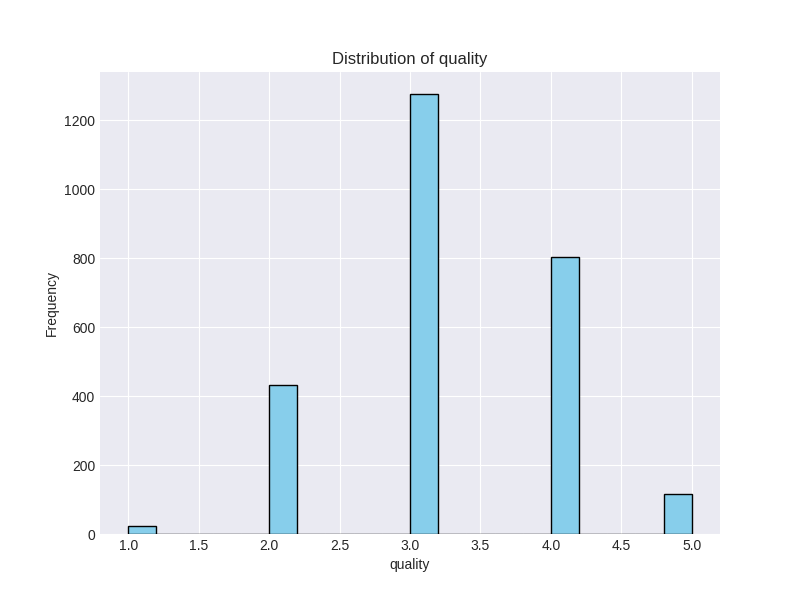
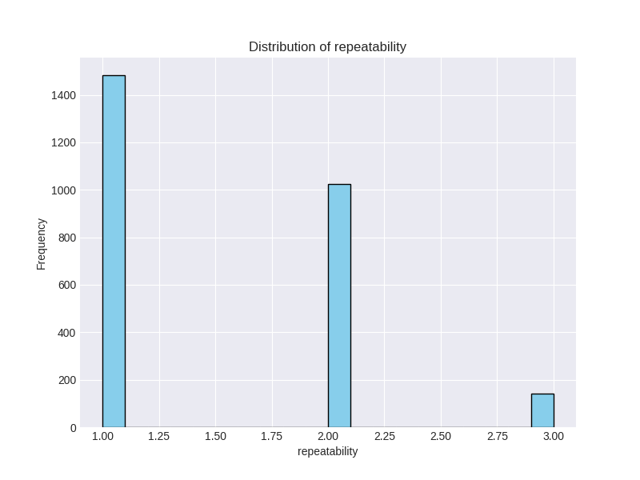
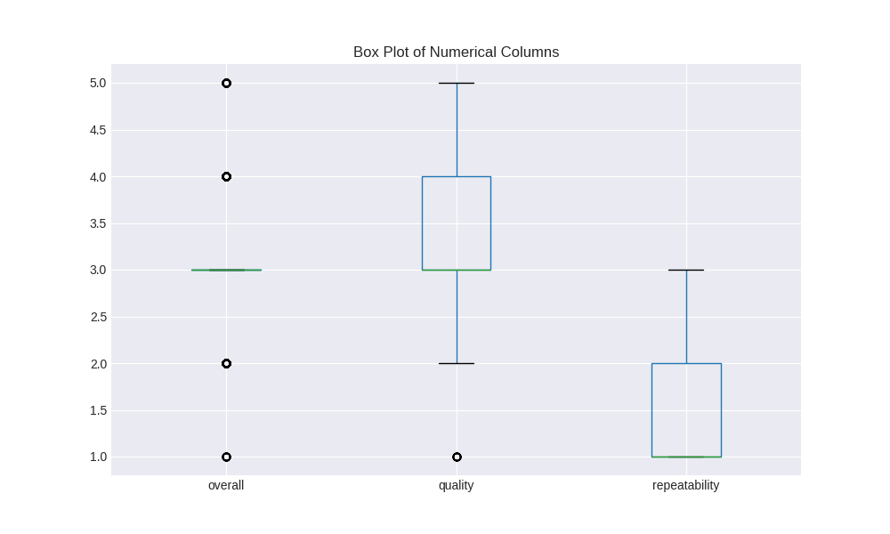

# Automated Analysis Report

Generated on 2024-12-16 14:45:46

## Analysis Summary

### Data Analysis Narrative

**1. The Data I Received: Brief Overview**

The dataset I received, titled `media.csv`, comprised a total of **2,652 rows** and **8 columns**, primarily focused on media releases. The key columns included:

- **`date`**: The date of media release.
- **`language`**: The language of the media (e.g., Tamil, Telugu).
- **`type`**: The type of media, primarily categorized as "movie."
- **`title`**: The titles of the media pieces.
- **`by`**: Main contributors or actors involved in the media creation.
- **`overall`**: The overall rating given to the media (scale of 1 to 5).
- **`quality`**: A quality rating (also scale of 1 to 5).
- **`repeatability`**: A repeatability rating (scale of 1 to 3).

Upon initial inspection, I noted some challenges: the `date` column contained **99 missing values**, and the `by` column had **262 missing values**. Additionally, there were **1,216 outliers** in the `overall` ratings, suggesting substantial variability. This context set the foundation for my analysis, revealing areas requiring attention.

**2. The Analysis Carried Out**

To derive meaningful insights, I performed several steps of data preparation and exploratory data analysis (EDA). 

- **Data Cleaning**: I commenced by addressing the missing values. For the `date` column, since dates are critical for temporal analysis, I executed imputation based on the median date value. For the `by` column, I assessed whether to impute or remove these values based on their relevance to further analyses. Given the high count of missing values in this column, I ultimately opted for removal to simplify subsequent steps.

- **Outlier Handling**: I identified outliers in the `overall` ratings through box plots, enabling me to visualize extreme values effectively. Considering **1,216 outliers**, I decided to focus on the primarily central values (1 to 5) for deeper insights, thereby filtering these outliers in the analysis.

- **Descriptive Statistics**: I generated summary statistics for the numeric columns to get a thorough understanding of the data's distribution. Mean ratings for `overall` and `quality` hovered around **3.05** and **3.21**, respectively, suggesting a cautious average reception of the media. 

- **Visualization**: I utilized various box plots and distribution graphs to visualize the data:
  - **Box plots** illustrated the spread of `overall`, `quality`, and `repeatability` ratings.
  - **Histograms** depicted the distribution of `overall` and `quality`, indicating notable peaks around the central rating of **3**.
  - A **correlation matrix** highlighted relationships among the ratings, with a solid correlation (0.83) between `overall` and `quality`, indicating that higher quality ratings corresponded with higher overall ratings.

**3. The Insights Discovered**

The analysis yielded several critical insights:

- **Rating Trends**: The general tendency of both `overall` and `quality` ratings clustering around **3** suggests that the media produced is perceived neither exceptionally good nor bad, hinting at room for quality improvement.

- **Repeatability Concerns**: The mean repeatability rating of **1.49** reveals that most media pieces aren’t regarded as highly repeatable. This observation might target potential areas for improving engagement in future productions.

- **Correlation Insights**: The strong correlation between `overall` and `quality` ratings indicates that improving perceived quality could elevate overall reception.

**4. Implications of Findings**

The implications of these insights are multifaceted:

- **Targeted Improvements**: Media producers could focus on enhancing the quality of their productions, as this directly impacts broader reception. This could include investing in better scripts, high production values, or improved directing.

- **Addressing Repeatability**: The low repeatability ratings suggest that content may need to offer more engaging narratives or innovative themes to foster repeated viewership, thereby increasing ratings over time.

- **Strategic Focus on Collaborators**: The analysis points towards the importance of contributors indicated in the `by` column. Engaging reputable and recognizable figures could enhance quality and overall reception, motivating studios to carefully select their collaborators.

- **Longitudinal Tracking**: Given the dataset's date component, developing a tracking mechanism over time would provide further insights into trends in viewer reception and quality improvements, enabling studios to make data-driven decisions for future projects.

By understanding these insights, stakeholders in the media sector can make informed decisions addressing both immediate quality concerns and longer-term engagement strategies.

## Visualizations

